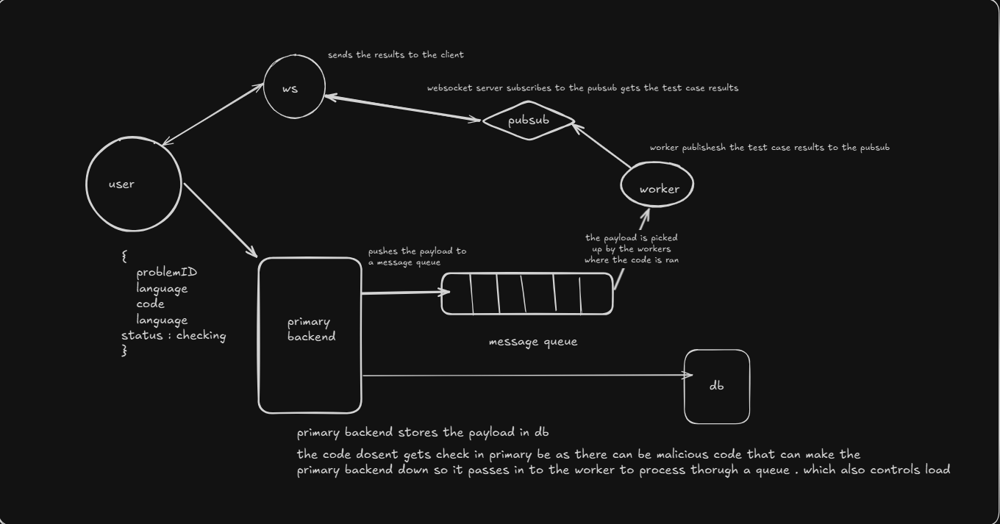

leetcode like architecture with microservices . the user sends the problem to the primary backend , the primary backend pushesh the probelm to a redis queue , the workers picks up the probelm from the queue processes it and publishes the test cases result to a pub sub and the web socket server subscribes to the pub sub and sends the result to clnt

it handles load efficiently because the payload is getting pushed to a message queue
and the problem is picked up by the workers from the queue whoever are free

this helps in a situation where there are multiple users submitting probelms ... so the backend dosent gets overloaded and the workers take one by one from the queue and publishes to the pub sub . which makes the system fast and efficient

